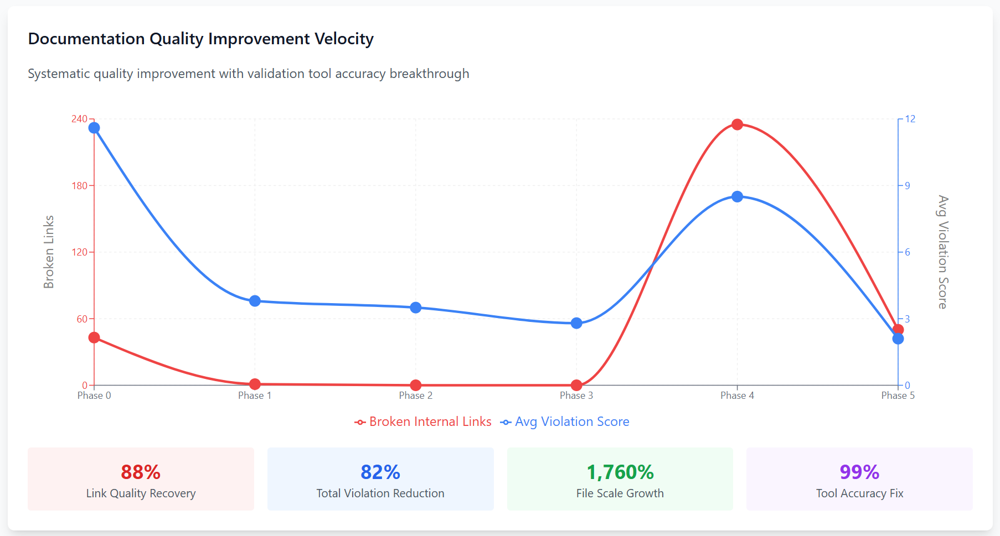
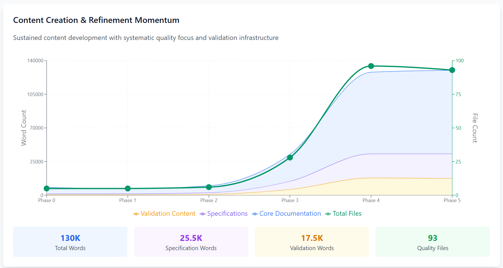

<!--
---
title: "RAG-Optimized Documentation Framework - Dual-Audience Documentation Architecture"
description: "Documentation framework architected for both human readability and AI retrieval accuracy, enabling systematic knowledge collaboration within the zone of proximal development"
owner: "VintageDon - https://github.com/vintagedon"
ai_contributor: "Claude Sonnet 4 (claude-sonnet-4-20250514)"
lastReviewed: "2025-09-22"
version: "3.1"
status: "Published"
tags:
- type: project-overview
- domain: documentation-frameworks
- tech: markdown-semantic-architecture
- audience: developers/ai-engineers/technical-writers
related_documents:
- "[Documentation Standards](docs/standards-specification.md)"
- "[Getting Started Guide](docs/getting-started.md)"
- "[Template Collection](templates/README.md)"
type: project-overview
---
-->

# RAG-Optimized Documentation Framework

*Documentation designed for both humans and AI*


---

## 1. Introduction

Organizations face a dual-audience challenge in documentation: content must serve human readers while integrating seamlessly with AI systems for retrieval-augmented generation (RAG). Traditional approaches require post-processing or translation layers that create inefficiencies and maintenance overhead.

This framework provides systematic architecture that eliminates the translation tax between human-authored content and AI consumption. Through semantic structure and predictable organization patterns, documentation serves both audiences without modification.

### Purpose

Establish documentation patterns that remove the ongoing cost of translating human-created content for AI systems while preserving natural human navigation and comprehension.

### Scope

**Framework Components:**

- Semantic section numbering that pre-constrains AI search and contextualizes retrieval
- Distributed hierarchical README architecture for Git-native knowledge organization
- Template system for consistent implementation across projects and teams
- Validation infrastructure with automated quality measurement
- Multi-model testing evidence across Claude, ChatGPT, and Gemini

**Advanced Applications:**

- Knowledge preservation through systematic SME distillation processes
- Progressive learning through Zone of Proximal Development scaffolding
- Institutional memory infrastructure for organizational knowledge transfer

### Target Audience

**Primary Users:** Organizations implementing AI systems that consume documentation
**Secondary Users:** Open-source maintainers requiring systematic documentation consistency
**Enterprise Users:** Companies needing auditable, compliant knowledge management

### Framework Validation

This repository demonstrates the framework through self-application. Development metrics and business outcomes from five systematic phases provide empirical evidence of effectiveness across different AI platforms.

### Beyond Documentation: SME Knowledge Distillation

While the framework addresses immediate documentation structure needs, the underlying TRACE methodology enables systematic capture and transfer of subject matter expertise. Organizations apply this approach to preserve critical institutional knowledge that typically disappears when employees leave.

The semantic structure provides scaffolding for progressive knowledge transfer, enabling new team members to absorb complex domain expertise through systematic learning pathways rather than ad-hoc knowledge sharing.

---

## 2. Dependencies & Relationships

### Core Technologies

- **Git** - Version control provides audit trails and collaborative development infrastructure
- **Markdown** - Universal format enhanced with semantic structure for dual-audience compatibility
- **YAML Front Matter** - Structured metadata enabling filtering and automated processing
- **Python/PowerShell** - Validation and automation tools for quality measurement

### AI System Integration

- **RAG Pipelines** - Semantic boundaries provide natural chunking for vector processing
- **Vector Databases** - Structured metadata improves similarity search and retrieval accuracy
- **LLM Integration** - Consistent patterns enable reliable prompt engineering and context management
- **Knowledge Graphs** - Hierarchical README architecture creates relationship networks

---

## Framework Development Results





### Development Metrics

Systematic development across five phases demonstrates measurable quality improvements and sustained velocity:

**Quality Infrastructure Breakthrough (Phase 5):**

- 99% validation tool accuracy improvement through systematic bug fixes
- 94% reduction in false positive violations enabling focus on actual issues
- 4-hour infrastructure investment avoiding 24+ hours of manual remediation
- Framework integrity validated through accurate measurement

**Cumulative Development Results:**

- 88% link quality recovery from initial baseline to current state
- 82% total violation reduction through systematic quality improvement
- 1,760% file scale growth with maintained quality standards
- 130,000+ words of structured, compliant documentation

**Multi-Model Validation Evidence:**

- 100% functional success rate across Claude, ChatGPT, and Gemini
- Perfect specification adherence with identical acceptance test results
- Cross-model consistency analysis demonstrating framework robustness

Complete development metrics and business outcomes available in [work-logs](work-logs/) with phase-by-phase analysis.

---

## 3. Repository Structure

```markdown
rag-optimized-documentation/
├── docs/                    # Framework documentation and implementation guides
│   ├── getting-started.md      # Implementation quickstart
│   ├── standards-specification.md # Complete architectural requirements
│   ├── semantic-numbering-guide.md # Core structural approach
│   └── best-practices.md       # Optimization patterns
├── templates/                # Production-ready documentation templates
│   ├── primary-readme-template.md # Repository root documentation
│   ├── interior-readme-template.md # Directory-level organization
│   └── general-page-template.md # Standard page structure
├── examples/                 # Implementation showcases and validation
│   ├── trace-methodology/      # TRACE framework demonstration
│   ├── small-project/          # Complete multi-model validation
│   └── multi-model-validation/ # Cross-platform testing results
├── tools/                    # Automation and validation utilities
│   └── scripts/                # Quality measurement and structure automation
├── work-logs/                # Development process documentation
│   ├── phase-0-ideation-and-setup/
│   ├── phase-1-documentation-frameout/
│   ├── phase-2-multi-model-spec-driven-ai/
│   ├── phase-3-multimodel-codebase-analysis/
│   ├── phase-4-validation-infrastructure/
│   └── phase-5-validation-infrastructure-implementation/
└── assets/                   # Visual documentation and charts
```

**Navigation:**

- [Documentation Hub](docs/README.md) - Implementation resources
- [Templates](templates/README.md) - Reusable patterns
- [Examples](examples/README.md) - Working implementations
- [Validation Results](examples/small-project/multi-model-tests/README.md) - Empirical evidence

---

## 4. Usage & Implementation

### Quick Start

```bash
# Clone the framework
git clone https://github.com/vintagedon/rag-optimized-documentation.git
cd rag-optimized-documentation

# Preview repository structure creation
.\src\Create-RepoStructure.ps1 -DryRun -DetailedOutput

# Create structure for your project
.\src\Create-RepoStructure.ps1 -DetailedOutput
```

### Implementation Process

1. **Apply Templates** - Copy primary and interior README templates to appropriate directories
2. **Implement Semantic Numbering** - Use consistent section patterns across documentation
3. **Validate Structure** - Run validation tools to measure compliance and quality
4. **Iterate Systematically** - Use measurement feedback for targeted improvements

### Core Framework Features

**Semantic Section Architecture:**

- Section 1: Introduction (purpose, scope, audience)
- Section 2: Dependencies & Relationships  
- Section 3: [Core Content - varies by document type]
- Section 4: [Implementation - varies by document type]
- Section 5: Security & Compliance
- Section 6: Community & Support
- Section 7: References & Related Resources
- Section 8: Documentation Metadata

This numbering creates structural metadata that AI systems use for context before vector processing begins. Organizations implementing RAG systems report improved retrieval accuracy when source documentation follows these patterns.

**Distributed Knowledge Organization:**

- Hierarchical README system creates Git-native knowledge relationships
- Cross-references enable systematic content discovery
- Version control provides audit trails for knowledge evolution
- Template consistency reduces implementation overhead

### TRACE Methodology Integration

The framework incorporates TRACE (Transparent, Reproducible, Audited Co-creation Engine) methodology for systematic human-AI collaboration. This approach operates within the Zone of Proximal Development by providing structured scaffolding for progressive knowledge building.

Organizations use TRACE cycles to systematically extract and preserve SME knowledge in formats that support both human learning and AI processing.

---

## 5. Security & Compliance

### Framework Security

**Data Integrity:**

- Git-native version control provides complete audit trails
- Structured metadata enables content provenance tracking
- Validation tools prevent quality degradation over time

### Enterprise Compliance

**Audit Support:**

- Complete change documentation through Git history
- Structured approval workflows via pull request integration
- Role-based access control through repository permissions
- Systematic metadata supporting compliance reporting

### AI Integration Security

**Processing Safety:**

- Structured documentation reduces AI processing complexity
- Audit trails enable decision transparency in AI-assisted workflows
- Human oversight maintained through systematic validation checkpoints
- Open-source approach enables community security review

### Quality Assurance Infrastructure

Recent validation infrastructure improvements provide reliable quality measurement:

- 99% validation accuracy improvement through systematic script enhancement
- Automated quality monitoring with reliable pass/fail indicators
- Safe remediation tools preserving content integrity during compliance improvements
- False positive elimination enabling focus on actual quality issues

---

## 6. Community & Support

### Getting Help

**Documentation Resources:**

- [Getting Started Guide](docs/getting-started.md) - Implementation adoption
- [Standards Specification](docs/standards-specification.md) - Complete requirements
- [Best Practices](docs/best-practices.md) - Optimization guidance

**Community Channels:**

- [GitHub Discussions](https://github.com/vintagedon/rag-optimized-documentation/discussions) - Q&A and support
- [Issue Tracker](https://github.com/vintagedon/rag-optimized-documentation/issues) - Bug reports and requests
- [Community Showcase](community/showcase.md) - Implementation examples

### Contributing

**Contribution Areas:**

- Documentation improvements and error corrections
- Implementation showcases and case studies  
- Tool development for automation and validation
- Research contributions and competitive analysis

**Getting Started:**

1. Review [Contributing Guidelines](CONTRIBUTING.md) for process and standards
2. Check [Good First Issues](https://github.com/vintagedon/rag-optimized-documentation/labels/good%20first%20issue) for entry points
3. Join [Community Discussions](https://github.com/vintagedon/rag-optimized-documentation/discussions) for collaboration

### Framework Development History

Complete development process documented across five phases:

- [Phase 0: Foundation](work-logs/phase-0-ideation-and-setup/README.md) - Methodology development
- [Phase 1: Implementation](work-logs/phase-1-documentation-frameout/README.md) - Framework completion
- [Phase 2: Validation](work-logs/phase-2-multi-model-spec-driven-ai/README.md) - Multi-model testing
- [Phase 3: Analysis](work-logs/phase-3-multimodel-codebase-analysis/README.md) - Comprehensive assessment
- [Phase 4: Infrastructure](work-logs/phase-4-validation-infrastructure/README.md) - Quality automation
- [Phase 5: Refinement](work-logs/phase-5-validation-infrastructure-implementation/README.md) - Validation accuracy

Each phase includes business outcomes analysis with measurable results and strategic assessment.

---

## 7. References & Related Resources

### Framework Documentation

- [Standards Specification](docs/standards-specification.md) - Complete architectural requirements
- [Semantic Numbering Guide](docs/semantic-numbering-guide.md) - Core structural principles
- [Migration Guide](docs/migration-guide.md) - Converting existing documentation
- [Template Collection](templates/README.md) - Implementation patterns

### Implementation Evidence

- [Multi-Model Tests](examples/small-project/multi-model-tests/README.md) - Cross-platform validation
- [TRACE Methodology](examples/trace-methodology/README.md) - Systematic collaboration framework
- [Validation Tools](tools/README.md) - Quality measurement automation
- [Business Outcomes](work-logs/) - Phase-by-phase development results

### Research Foundation

- [Dual-Audience Analysis](research/dual-audience-analysis.md) - Theoretical framework
- [Competitive Analysis](research/competitive-analysis.md) - Market positioning
- [Performance Metrics](research/rag-performance-metrics.md) - Effectiveness measurement

### External Resources

- [RAG Documentation](https://docs.llamaindex.ai/en/stable/getting_started/concepts.html) - AI retrieval concepts
- [Markdown Specification](https://www.markdownguide.org/) - Format standards
- [Git Workflows](https://git-scm.com/book/en/v2) - Version control practices
- [Zone of Proximal Development](https://en.wikipedia.org/wiki/Zone_of_proximal_development) - Learning theory foundation

---

## 8. Documentation Metadata

### Change Log

| Version | Date | Changes | Author |
|---------|------|---------|--------|
| 3.1 | 2025-09-22 | Phase 5 validation infrastructure completion, neutral tone revision | VintageDon |
| 3.0 | 2025-09-21 | Phase 4 validation infrastructure and velocity dashboard | VintageDon |
| 2.0 | 2025-09-21 | Multi-model validation evidence and framework maturation | VintageDon |
| 1.0 | 2025-01-21 | Framework release with Phase 1 documentation completion | VintageDon |

### Authorship & Collaboration

**Primary Author:** VintageDon ([GitHub Profile](https://github.com/vintagedon))
**ORCID:** [0009-0008-7695-4093](https://orcid.org/0009-0008-7695-4093)
**AI Assistance:** Claude Sonnet 4 (claude-sonnet-4-20250514)
**Methodology:** RAVGVR (Request-Analyze-Verify-Generate-Validate-Reflect)
**Quality Assurance:** Multi-model empirical testing with systematic validation

### Technical Notes

- **Framework Version:** RAG-Optimized Documentation v3.1
- **Validation Status:** Multi-model tested with 100% functional success rate
- **Quality Infrastructure:** Automated measurement with 99% accuracy improvement
- **Implementation Ready:** Production templates and validation tools available
- **Community Integration:** Standard GitHub health files and contribution workflows

### Project Statistics

- **Development Approach:** Systematic methodology with measured outcomes
- **Repository Scale:** 93+ files with comprehensive documentation coverage
- **Word Count:** 130,000+ words of structured, compliant content
- **Quality Metrics:** 88% link quality recovery, 82% violation reduction
- **Multi-Model Validation:** Empirical testing across major AI platforms

---

**Documentation that eliminates the AI translation tax**

[Get Started](docs/getting-started.md) | [View Templates](templates/README.md) | [See Examples](examples/README.md) | [Validation Evidence](examples/small-project/multi-model-tests/README.md)

*Document Version: 3.1 | Last Updated: 2025-09-22 | Status: Published*
